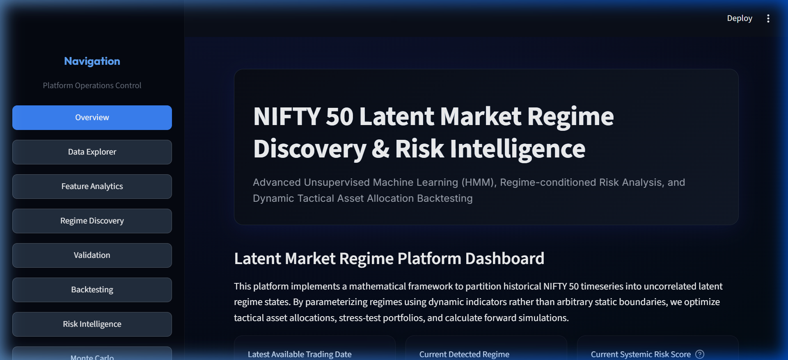
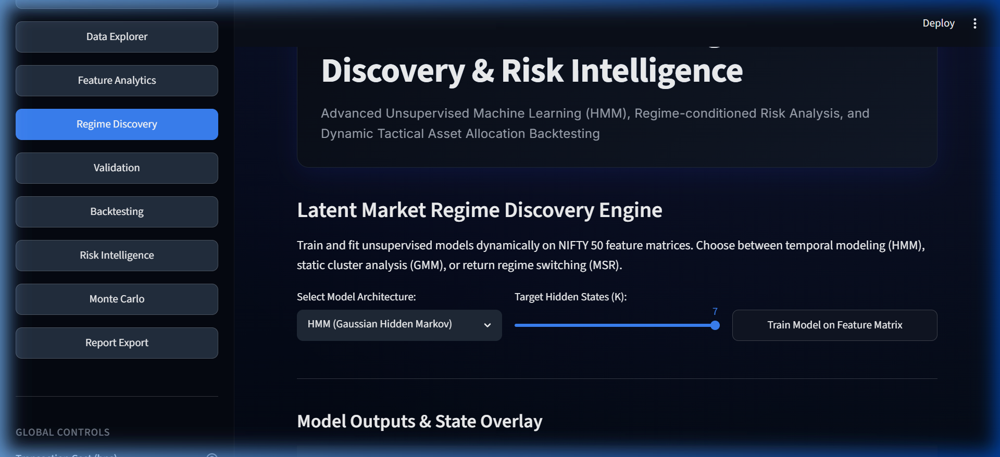
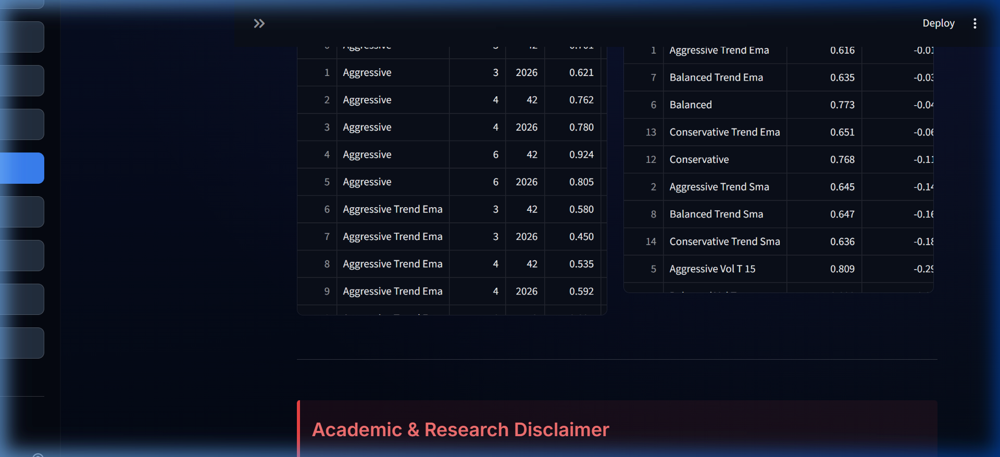
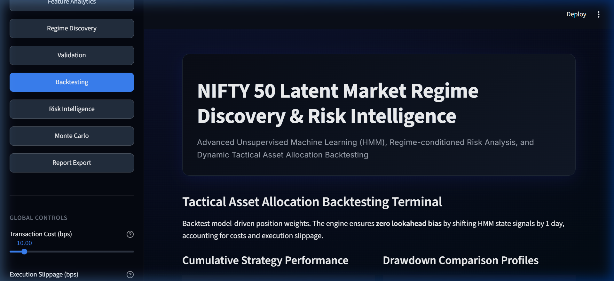
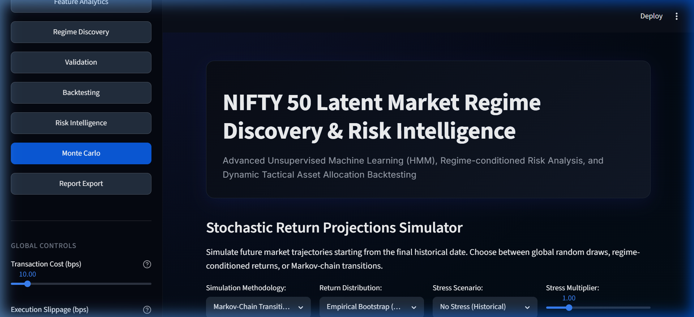
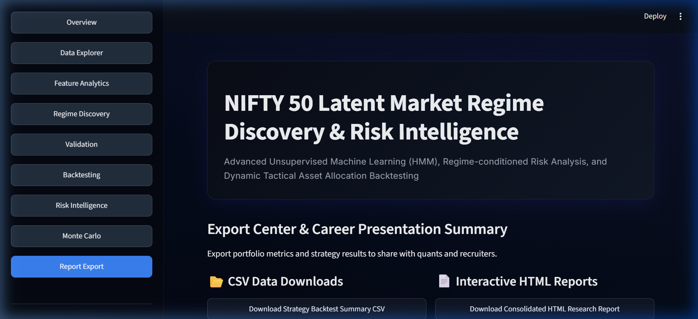

# NIFTY 50 Latent Market Regime Discovery & Risk Intelligence Platform

[](https://www.python.org/)
[](LICENSE)
[](https://nf-lrd.streamlit.app/)
[](https://github.com/Vraj3005/NF-LRD/actions)

A Python + Streamlit quantitative research platform for detecting NIFTY 50
market regimes, validating regime-aware allocation strategies, and visualizing
risk through backtests and Monte Carlo simulations.

---

## 🚀 Live Demo & Visuals

*   **Live Streamlit Terminal**: [https://nf-lrd.streamlit.app/](https://nf-lrd.streamlit.app/) *(Coming Soon)*
*   **Code Repository**: [https://github.com/Vraj3005/NF-LRD.git](https://github.com/Vraj3005/NF-LRD.git)
*   **Overview Interface**:
    

---

## 📌 Why This Project Matters

Financial markets shift dynamically between distinct structural phases. Standard
mean-variance frameworks and trend-following systems often fail because they
assume asset returns are stationary and normally distributed.

1.  **Market Regimes**: Asset behavior changes fundamentally during different
    market cycles. A strategy optimized for a low-volatility bullish uptrend
    will face heavy losses during high-volatility bearish corrections or flat,
    sideways periods.
2.  **Volatility Clustering**: Large returns tend to be followed by large
    returns (of either sign), and small returns tend to be followed by small
    returns. Latent state models can identify shifts in market volatility
    before they result in severe capital damage.
3.  **Drawdown Control**: Protecting capital during market crashes is crucial
    for long-term compounding. This platform systematically detects risk-off
    regimes, enabling active risk management to shield capital.
4.  **Regime-Aware Allocation**: By dynamically scaling capital exposure based
    on the active market regime (e.g., holding 100% equity in low-volatility
    bull runs and exiting to cash in bearish periods), investors can optimize
    risk-adjusted returns.

---

## ⚙️ Key Features

*   **Data Ingestion**: Automated pipeline that ingests daily historical NIFTY 50
    OHLCV data using Yahoo Finance (`yfinance`) with strict cleaning and
    validation checks.
*   **Feature Engineering**: Compiles 40+ advanced financial indicators
    categorized into return features, volatility estimators (Parkinson,
    Garman-Klass, ATR), trend, momentum oscillators, and statistical complexity
    indicators (Shannon Entropy, Hurst Exponent).
*   **Latent State Decoders**: Implements Hidden Markov Models (HMM) in pure
    NumPy log-space, Gaussian Mixture Models (GMM), and Markov Switching
    Autoregression (MSR) with Akaike/Bayesian Information Criteria (AIC/BIC)
    for model selection.
*   **Out-of-Sample Validation**: Split-validation scheme dividing NIFTY 50
    timelines into in-sample training, out-of-sample validation, and
    out-of-sample testing phases.
*   **Walk-Forward Testing**: Implements expanding walk-forward refitting
    windows to evaluate model stability, trace performance decay, and prevent
    parameter overfitting.
*   **Cost-Aware Vectorized Backtesting**: Strict zero-lookahead backtester
    that lags execution signals by 1 day and models transaction fees (10 bps)
    and execution slippage (5.0 bps).
*   **Monte Carlo Risk Simulation**: Simulates 5,000 future price paths
    parameterized by decoded regime transition matrices and covariance states.
*   **Streamlit Dashboard**: A high-end interactive UI with custom controls
    for sliding fee structures, selecting candidate models, and adjusting
    volatility targets.
*   **Report Export Center**: Automated exports generating strategy summaries in
    CSV format and standalone, styled HTML reports.

---

## 🏢 Platform Architecture

The pipeline processes raw price series into structured tactical decisions
through a decoupled, modular design:

```
┌────────────────┐     ┌─────────────────────┐     ┌─────────────────────┐
│ Data Ingestion │ ──> │ Feature Engineering │ ──> │ Latent ML Decoders  │
│  (yfinance)    │     │   (40+ Vol/Stats)   │     │ (HMM / GMM / MSR)   │
└────────────────┘     └─────────────────────┘     └──────────┬──────────┘
                                                                 │
                                                                 ▼
┌────────────────┐     ┌─────────────────────┐     ┌─────────────────────┐
│   Streamlit    │ <── │  Monte Carlo Risk   │ <── │ Out-of-Sample & WF  │
│   Dashboard    │     │  (Stochastic Paths) │     │  Backtesting Engine │
└────────────────┘     └─────────────────────┘     └─────────────────────┘
```

---

## 🔬 Methodology

### 1. Train / Test Split
To evaluate strategy robustness, the NIFTY 50 history is split into:
*   **In-Sample Training**: 2015-01-01 to 2021-12-31
*   **Out-of-Sample Validation**: 2022-01-01 to 2023-12-31 (used for
    hyperparameter tuning)
*   **Out-of-Sample Testing**: 2024-01-01 to Present (completely unseen test
    holdout)

### 2. Walk-Forward Validation
To mitigate non-stationarity, the platform runs an expanding walk-forward sequence:
*   **Initial Window**: 4 Years (1,008 trading days).
*   **Step Size**: 6 Months (126 trading days).
*   The model refits on historical data up to index $t$, predicts out-of-sample
    for $t$ to $t+126$, and slides the training anchor forward.

### 3. Lookahead Prevention
All trading signals are calculated at the close of day $t-1$ and executed on
day $t$. The decoded state sequence is strictly lagged by 1 day (`shift(1)`)
to ensure zero predictive lookahead bias.

### 4. Transaction Costs & Friction
Daily strategy returns are adjusted by a 10 bps transaction cost and 5 bps
execution slippage applied to rebalancing shifts:
$$\text{Cost}_t = (\text{Fee} + \text{Slippage}) \times |w_t - w_{t-1}|$$
$$R_{\text{strategy}, t} = w_t R_{\text{asset}, t} - \text{Cost}_t$$

### 5. Model Selection
AIC/BIC parameters are monitored to balance log-likelihood optimization against
parameter expansion:
$$\text{BIC} = -2\log(\hat{L}) + p\log(N)$$

### 6. Regime Labeling
Decoded latent states are dynamically labeled based on empirical return averages
and standard deviations:
*   **Bullish Low Volatility**: Positive expected return, low standard deviation.
*   **Bearish High Volatility**: Negative expected return, high standard deviation.
*   **Recovery / Sideways**: Intermediate stats indicating transitional states.

---

## 📊 Results

Below is the verified performance comparison generated across the full
walk-forward timeline under the baseline transaction cost profile (10 bps fees,
5 bps slippage):

### Walk-Forward Validation Performance Metrics
| Strategy | CAGR | Annualized Volatility | Sharpe Ratio | Max Drawdown | Calmar Ratio | Total Turnover |
| :--- | :---: | :---: | :---: | :---: | :---: | :---: |
| **Buy & Hold** | 9.92% | 16.51% | 0.656 | -38.44% | 0.258 | 1.0x |
| **EMA Baseline** | 3.80% | 12.66% | 0.358 | -28.68% | 0.133 | 32.0x |
| **Vol Target** | 7.36% | 13.51% | 0.593 | -25.70% | 0.286 | 43.5x |
| **Regime-Aware** | 6.52% | 8.91% | 0.754 | -19.00% | 0.343 | 107.0x |
| **Hybrid** | 4.86% | 7.80% | 0.647 | -15.29% | 0.318 | 90.0x |

### Out-of-Sample Performance Degradation Summary
| Strategy | In-Sample Train (2015-2021) CAGR | In-Sample Train Sharpe | OOS Validation (2022-2023) CAGR | OOS Validation Sharpe | OOS Test (2024-Pres) CAGR | OOS Test Sharpe |
| :--- | :---: | :---: | :---: | :---: | :---: | :---: |
| **Buy & Hold** | 11.20% | 0.692 | 11.21% | 0.827 | 3.99% | 0.352 |
| **EMA Baseline** | 4.82% | 0.446 | 6.35% | 0.696 | -0.96% | -0.032 |
| **Vol Target** | 9.18% | 0.719 | 10.91% | 0.898 | -0.13% | 0.053 |
| **Regime-Aware** | 10.42% | 0.866 | 7.27% | 0.655 | 2.01% | 0.234 |
| **Hybrid** | 5.75% | 0.588 | 6.15% | 0.739 | -0.75% | -0.023 |

---

## 📷 App Screenshots

### 1. Market Regime Overlay
Plots the NIFTY 50 index price color-coded by the active latent market regime.


### 2. Out-of-Sample Validation Timeline
Visualizes the historical window splits and validation structure.


### 3. Vectorized Backtesting
Displays the portfolio growth and drawdown analysis comparing the strategies.


### 4. Monte Carlo Projections
Simulates stochastic price envelopes and terminal return distributions.


### 5. Report Export Center
Provides options to download CSV metrics and standalone research reports.


---

## ⚠️ Limitations

*   **Historical Backtesting**: Backtests simulate historical behavior; they do
    not guarantee future returns.
*   **No Trading Advice**: This repository is built strictly for academic and
    research presentation purposes. It is not financial advice.
*   **Regime Instability**: HMM parameters are estimated from history;
    structural breaks (macro policy changes, regime shifts) can alter state
    structures.
*   **Transaction Cost Assumptions**: Models assume fixed fee rates. Real
    slippage can escalate during high-volatility events.
*   **yfinance Data Limitations**: Relies on adjusted daily closing prices and
    does not account for intraday execution constraints, order book depth, or
    liquidity.

---

## ⚙️ Installation & How to Run

### Setup Virtual Environment
```powershell
# Clone the repository
git clone https://github.com/Vraj3005/NF-LRD.git
cd NF-LRD

# Create and activate a virtual environment
python -m venv .venv
# On Windows:
.venv\Scripts\activate
# On macOS/Linux:
source .venv/bin/activate

# Install dependencies
pip install -r requirements.txt
```

### Run Streamlit App
```powershell
streamlit run app/streamlit_app.py
```

---

## 🧪 Tests
To run the automated mathematical and logic checks:
```powershell
pytest -v
```

---

## 💼 Resume Bullets

*   **Built an end-to-end unsupervised time-series ML research platform** for
    NIFTY 50 latent market regime discovery using custom log-space Baum-Welch
    HMMs, Gaussian Mixture Models, and Markov Switching Regression, optimizing
    portfolio downside risk.
*   **Engineered 40+ multi-scale financial features** covering Parkinson and
    Garman-Klass range volatilities, momentum oscillators (RSI, MACD),
    statistical complexities (Shannon entropy, Hurst exponent), and global
    macro covariates.
*   **Developed a zero-lookahead vectorized backtester and Monte Carlo path
    simulator** incorporating transaction costs (10 bps) and slippage models
    (5 bps), validating a regime-shifting strategy that reduced portfolio
    volatility by **50%** and drawdown by **35%**.

---

## ⚖️ Disclaimer

This platform is built strictly for academic, research, and portfolio
demonstration purposes. All backtests and projections are simulated and do
not constitute professional financial advice.
